# Frontend : 
- **[Learn Here](https://youtube.com/playlist?list=PLbtI3_MArDOk_A-GnYHPOiHSxlK2Vd3Zn&si=B0jWoDKkDvtq6kMp)**
---
# Tools : 
🚩 Tool : 1.[Maven](https://www.youtube.com/watch?v=ybQAmFsVQqA)
- **Why Git and Github** :
-      Git & Github :  Track code changes, collaborate with teams, manage versions, contribute to open source, and deploy projects. These are essential skills for internships and jobs.
🚩 Tool : 2.[Git & Github](https://www.youtube.com/watch?v=MuZySo5lF8E)
---
# Complete Spring 
🚩 [Spring frame & Spring Boot](https://www.udemy.com/course/spring-boot-using-intellij-build-a-real-world-project/learn/lecture/51486789/?start=0&udfrontends=true)
-     Cover Ecommerce Project
- **Project** : [Blog Application](https://www.youtube.com/watch?v=tGb1dNMa5c8&list=PL6Rs84MkNq7kv3auhwU6gOVDvJ1eH_Wax&index=2)
- 🚩 [Unit Testing](https://youtu.be/sq_pYMepfP0?si=h5HT1oWt6wI0rJmI)

- 🚩 **[Spring Security Part - 1](https://youtu.be/Uc2LZFVxHoM?si=1s04jh2IrFFPRY1E)**
- 🚩 **[Spring Security Part - 2](https://www.youtube.com/watch?v=Kzx8MKA7Q0Y)**
- **Project: [Authentication System](https://youtube.com/playlist?list=PL0zysOflRCem2SLBwhDMok05hwLtRTRDr&si=WHT3NgL9lWb_Ay6X)**
- 🚩 **[Redis](https://www.youtube.com/watch?v=Pvc3DIr3Q1g)**

- **Spring Boot Project**
- **1. [Email Sender](https://youtube.com/playlist?list=PL0zysOflRCenujRE0Nfdqo3W6dJgiPlku&si=GyMNALPT-1WxygKz)**
- **2.[ AI Expense Tracker](https://youtu.be/PXnA665SKIY?si=OpcOh8ORxtPV2Wfa)**
- **3.[Bitly Clone](https://youtu.be/icm4JQdi9NU?si=4DHIsajT_BnmpPKl)**
---
# Linux & Open Source : 
- 🚩 [Linux](https://www.youtube.com/watch?v=sWbUDq4S6Y8&list=PL-OX3itZgXCLXSmue3C6qVIgz6tBAmVfz&index=2)
- 🚩 [Open Sourse](https://www.youtube.com/playlist?list=PLinedj3B30sBsmRRL8XyTGadjRGkzRPb7)
---
# Microservices : 
- 🚩 [Part - 1](https://www.youtube.com/watch?v=BLlEgtp2_i8)
- 🚩 [Part - 2](https://www.youtube.com/watch?v=EeQRAxXWDF4)
- **Project : Job Application**
-  🚩 [Kafka](https://youtu.be/NWLwGtkBrkQ?si=eq3zfhXVzeqaIttV)
-  🚩  
---
- [AWS](https://www.youtube.com/watch?v=2OHr0QnEkg4)
- [CI/CD](https://www.youtube.com/watch?v=Hi6MGNhImFc)
**Project - [Airline System](https://www.youtube.com/watch?v=yFoI4a3HbO0)**
---
- 🚩 Spring AI 
- **[Learn](https://www.youtube.com/playlist?list=PL0zysOflRCen1TeDUm-ebl9T-WbJygCGE)**
- **Project** :
- 1. [AI Powered Fitness Application](https://youtu.be/_FdKTSFnWeg?si=qcMbgbTh4GduYPov)
- 2. [AI Powered Job Application](https://www.youtube.com/watch?v=3jxt9Ekta-w)
- 3. [AI Powered Resume Builder](https://youtu.be/62dbESNu58M?si=772OfCRtKgxFNlGs)
- 4. [AI Smart Reaserch Assistent](https://youtu.be/IXn4OGaJfHA?si=Hs3upvXD9qUUUdxB)
---
## Tools & AI Assistance :
- **[Claude for Spring Boot Developer](https://youtu.be/j9OYHB9hRFU?si=lU2ozYYC6XMofLZe)**
# My Own Project : 
- Ai Career PathFinder SAAS App .
---
#  Making A portfolio : 
- 🚩 [Portfolio Website](https://www.youtube.com/watch?v=JSFIGIA9Zrk&list=PL07efmqYWHZ_rVeQ1ws0ER9eL6cxo-d5V&index=1)

# 🚀 Full-Stack Java + AI Roadmap

```mermaid
flowchart TD

    A["🚀 FULL-STACK JAVA + AI"]

    A --> B["🌐 FRONTEND"]
    A --> C["🛠️ TOOLS"]
    A --> D["☕ SPRING"]
    A --> E["🐧 LINUX & OPEN SOURCE"]
    A --> F["⚙️ MICROSERVICES"]
    A --> G["☁️ AWS & CI/CD"]
    A --> H["🤖 SPRING AI"]
    A --> I["🚀 OWN PROJECT"]
    A --> J["🌐 PORTFOLIO"]


    %% FRONTEND
    B --> B1["📚 HTML • CSS • JavaScript • React"]


    %% TOOLS
    C --> C1["Maven"]
    C --> C2["Git & GitHub"]


    %% SPRING
    D --> D1["📚 SPRING LEARNING"]
    D --> D2["🚀 SPRING PROJECTS"]

    D1 --> D11["Spring Framework + Spring Boot"]
    D1 --> D12["Unit Testing"]
    D1 --> D13["Spring Security"]
    D1 --> D14["Redis"]

    D2 --> D21["E-Commerce"]
    D2 --> D22["Blog Application"]
    D2 --> D23["Authentication System"]
    D2 --> D24["Email Sender"]
    D2 --> D25["AI Expense Tracker"]
    D2 --> D26["Bitly Clone"]


    %% LINUX
    E --> E1["Linux"]
    E --> E2["Open Source"]


    %% MICROSERVICES
    F --> F1["📚 MICROSERVICES LEARNING"]
    F --> F2["🚀 MICROSERVICES PROJECTS"]

    F1 --> F11["Microservices Part 1"]
    F1 --> F12["Microservices Part 2"]
    F1 --> F13["Kafka"]

    F2 --> F21["Job Application"]


    %% AWS
    G --> G1["AWS"]
    G --> G2["CI/CD"]
    G --> G3["Airline System"]


    %% SPRING AI
    H --> H1["📚 SPRING AI LEARNING"]
    H --> H2["🚀 SPRING AI PROJECTS"]

    H1 --> H11["Spring AI"]

    H2 --> H21["AI Powered Fitness"]
    H2 --> H22["AI Powered Job Application"]
    H2 --> H23["AI Powered Resume Builder"]
    H2 --> H24["AI Smart Research Assistant"]


    %% OWN PROJECT
    I --> I1["AI Career PathFinder SaaS"]


    %% PORTFOLIO
    J --> J1["Portfolio Website"]


    %% LINKS

    click B1 "https://youtube.com/playlist?list=PLbtI3_MArDOk_A-GnYHPOiHSxlK2Vd3Zn"

    click C1 "https://www.youtube.com/watch?v=ybQAmFsVQqA"
    click C2 "https://www.youtube.com/watch?v=MuZySo5lF8E"

    click D11 "https://www.udemy.com/course/spring-boot-using-intellij-build-a-real-world-project/"
    click D12 "https://youtu.be/sq_pYMepfP0"
    click D13 "https://youtu.be/Uc2LZFVxHoM"
    click D14 "https://www.youtube.com/watch?v=Pvc3DIr3Q1g"

    click D21 "https://www.udemy.com/course/spring-boot-using-intellij-build-a-real-world-project/"
    click D22 "https://www.youtube.com/watch?v=tGb1dNMa5c8"
    click D23 "https://youtube.com/playlist?list=PL0zysOflRCem2SLBwhDMok05hwLtRTRDr"
    click D24 "https://youtube.com/playlist?list=PL0zysOflRCenujRE0Nfdqo3W6dJgiPlku"
    click D25 "https://youtu.be/PXnA665SKiY"
    click D26 "https://youtu.be/icm4JQdi9NU"

    click E1 "https://www.youtube.com/watch?v=sWbUDq4S6Y8"
    click E2 "https://www.youtube.com/playlist?list=PLinedj3B30sBsmRRL8XyTGadjRGkzRPb7"

    click F11 "https://www.youtube.com/watch?v=BLlEgtp2_i8"
    click F12 "https://www.youtube.com/watch?v=EeQRAxXWDF4"
    click F13 "https://youtu.be/NWLwGtkBrkQ"
    click F21 "https://www.youtube.com/watch?v=BLlEgtp2_i8"

    click G1 "https://www.youtube.com/watch?v=2OHr0QnEkg4"
    click G2 "https://www.youtube.com/watch?v=Hi6MGNhImFc"
    click G3 "https://www.youtube.com/watch?v=yFoI4a3HbO0"

    click H11 "https://www.youtube.com/playlist?list=PL0zysOflRCen1TeDUm-ebl9T-WbJygCGE"
    click H21 "https://youtu.be/_FdKTSFnWeg"
    click H22 "https://www.youtube.com/watch?v=3jxt9Ekta-w"
    click H23 "https://youtu.be/62dbESNu58M"
    click H24 "https://youtu.be/IXn4OGaJfHA"

    click I1 "https://github.com/"

    click J1 "https://www.youtube.com/watch?v=JSFIGIA9Zrk"
```

